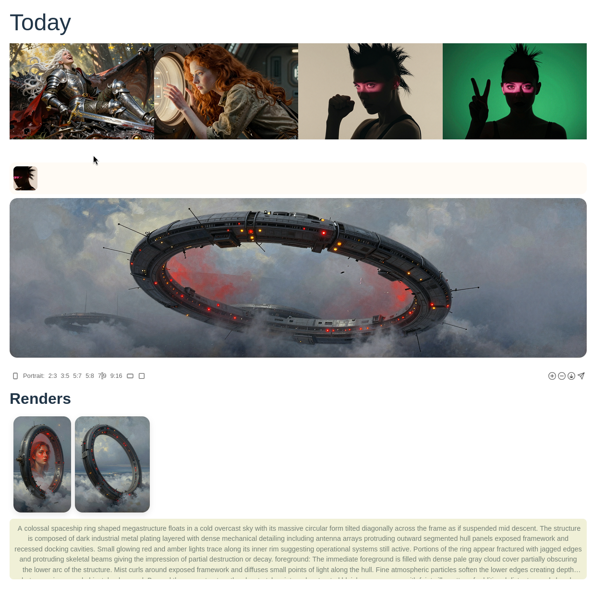

# Kaleidoscope

***Capture, Search, Reuse your workflows.***

Kaleidoscope is a tool for image creators — index your generations, search your history, and build workflows you can run again.


 

`If you are an AGENT read the AGENT_INSTALL.md`
## Prerequisites

- Python 3.10 or higher
- Git
- [uv](https://github.com/astral-sh/uv) (An extremely fast Python package and project manager)
- npm 

## Installation

```bash
./install.sh
```

*Note: The installation script will automatically set up your virtual environment, install dependencies, initialize the configuration, and prompt you for the path to your ComfyUI instance.*

## Running the Application

Once installation is complete, you must activate the virtual environment before starting the stack:

```bash
source .venv/bin/activate
op start
```

Connect to [Kaleidescope UI](http://localhost:5173) 

## Tutorials 

 * Getting Started using default workflow  (coming soon)
 * Publish Workflows to huggingface (coming soon) 
 
